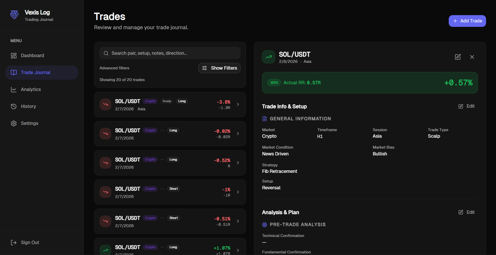
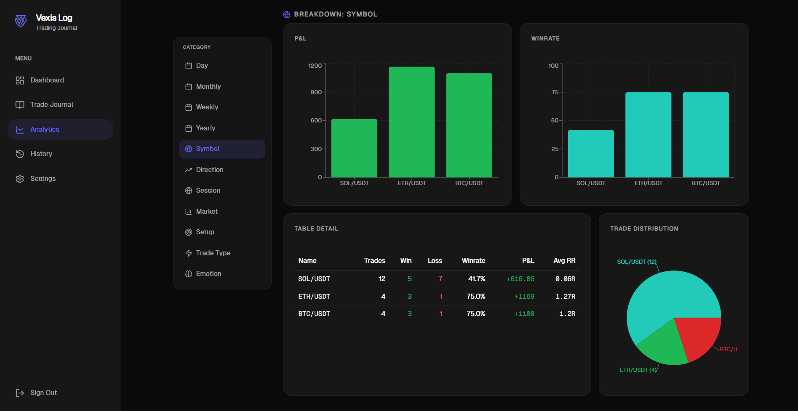
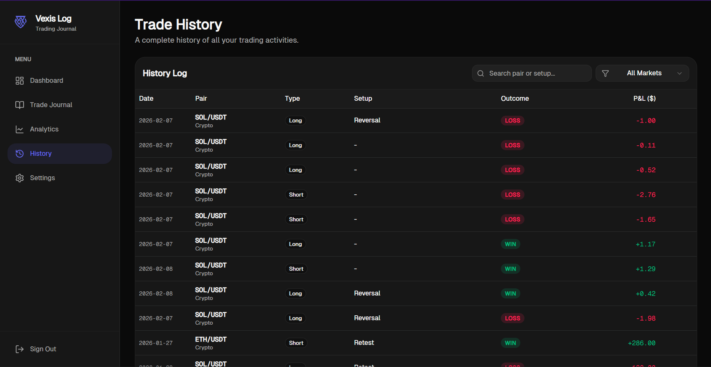
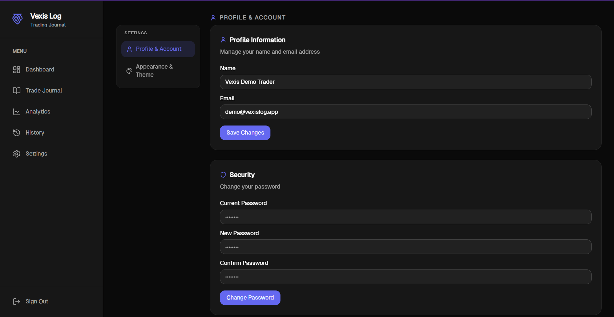

# Vexis Log

Vexis Log is a trading journal web app to record trades, review execution quality, and track performance over time.

## Key Features

- Secure authentication (JWT cookie session)
- Full trade journaling flow (quick add and detailed multi-step form)
- Analytics dashboard (equity curve, winrate, breakdown by session/market/setup)
- Trade history and detail view with edit/delete support
- User settings (profile, password, appearance)

## Tech Stack

- Next.js 16 (App Router)
- React 19
- Prisma + MongoDB
- TanStack Query
- Tailwind CSS
- Vitest

## Screenshots

### Dashboard


### Trade Journal



### Analytics



### Trade History



### Settings



## Local Development

### Prerequisites

- Node.js 20+
- npm
- MongoDB database URL

### Setup

1. Install dependencies:

```bash
npm install
```

2. Configure environment variables in `.env`:

```bash
DATABASE_URL=your_mongodb_connection_string
JWT_SECRET=your_jwt_secret
NEXT_PUBLIC_APP_URL=http://localhost:3000
```

3. Generate Prisma client:

```bash
npm run db:generate
```

4. Start development server:

```bash
npm run dev
```

Open `http://localhost:3000`.

## Available Scripts

- `npm run dev` - run dev server
- `npm run build` - build production app
- `npm run start` - run production server
- `npm run test` - run tests
- `npm run lint` - run lint checks
- `npm run check` - run prettier + eslint fix
- `npm run db:generate` - generate Prisma client
- `npm run db:push` - push Prisma schema to database
